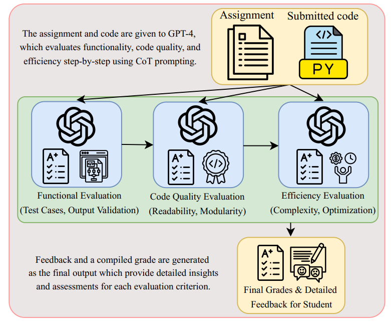
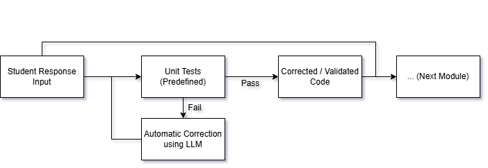
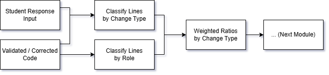
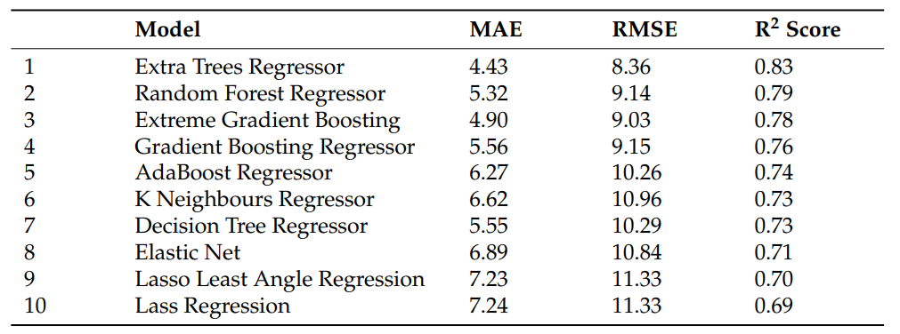

# Automated Code Grading: Recent Approaches
**Author:** Chu Nguyen Gia Khanh
**Date:** March 7, 2026

## Important Notes
For the upcoming project on the automated grading of coding assignments, **GPT-oss 120B** (accessed via the API from Groq) will be used as the main LLM. Based on practical availability and cost constraints, this model appears to be the most suitable option for the project.

## Contents
1. [Introduction](#1-introduction)
2. [Recent Methods leveraging LLMs for automated code assessment](#2-recent-methods-leveraging-llms-for-automated-code-assessment)
  2.1 [StepGrade: Chain-of-Thought and Prompt Chaining](#21-stepgrade-chain-of-thought-and-prompt-chaining)
  2.2 [CodEv - CoT and LLM Ensemble (Intra-model Ensemble)](#22-codev---cot-and-llm-ensemble-intra-model-ensemble)
  2.3 [A Combination of Unit Testing, LLM and Machine Learning](#23-a-combination-of-unit-testing-llm-and-machine-learning)

&ZeroWidthSpace; &ZeroWidthSpace; &ZeroWidthSpace; &ZeroWidthSpace; [References](#references)

## 1. Introduction
Automated grading of programming exercises has become an important problem in computer science education. Programming courses at university often enroll up to hundreds of students, and with weekly assignments, manual grading can be labour-intensive and time-consuming. As a result, researchers and educators have explored automated systems capable of evaluating code quickly and with reasonable accuracy.

This documentation presents several recent methods leveraging LLMs for automated code assessment, with the goal of identifying useful ideas for the upcoming project aimed at automating or assisting the grading of coding assignments.

## 2. Recent Methods Leveraging LLMs for Automated Code Assessment
### 2.1 StepGrade: Chain-of-Thought and Prompt Chaining
Chain-of-Thought (CoT) and prompt chaining were utilised in an automated framework called StepGrade to guide an LLM (specifically GPT-4) in evaluating code according to specific rubrics in several prompts [[1](#references)].

The framework grades the submission using one prompt per rubric, resulting in the following three-step process:
- For the first step in the process, GPT-4 is given the assignment question (for context) and a code submission to be evaluated. Along with these is a prompt guiding the model to assess the functionality of the code. 
- For later steps (steps 2 and 3), apart from the question, submission and prompt for the rubric, GPT-4 also receives the its previous response of all previous step to provide context-aware responses.

  
   
  <em><small><b>Fig 1.</b> The grading process in the StepGrade framework.</small></em>

The detailed prompt given to the model at each step is as follows:

  
   
  <em><small><b>Fig 2.</b> The detailed prompt at each step of the grading process.</small></em>

 

In the paper introducing the StepGrade framework, the approach achieved a Mean Absolute Error (MAE) of around 4.0% to 6.2% for each grading rubric relative to human grading on 30 Python programming assignments.

Overall, by utilising CoT and prompt chaining, the framework achieved reasonably accurate grading results compared to human. However, this paper was examining the framework using GPT-4, a large model, which will definitely not be available for the project. This indicates that with the currently available GPT-oss 120B API, the same workflow may yields worse results.

### 2.2 CodEv - CoT and LLM Ensemble (Intra-model Ensemble)
CodEv is a framework that utilises CoT and LLM ensemble to grade code on several rubrics (correctness of output, code readability and functionality) [[2](#references)]. The workflow can be summarised as follows:
- There is a CoT guided prompt that includes the problem statement, grading criteria and the student answers. This prompt is then be used to generate scores repeatedly (up to 20 times) from a single LLM.
- The mode of the scores generated is then selected as the final score for a student answer (Sampling and Voting).

  
   
  <em><small><b>Fig 3.</b> The mode being chosen as the final score (m is the number of students, Q is the number of ensemble iterations for each student submission).</small></em>

 

This framework is evaluated using four different LLMs: Smaller models include Llama 3.1 8B, Gemma 2 9B, and for larger models, Llama 3.1 70B and GPT-4o. The results were highly consistent.

For larger models, the final score MAE relative to human scoring (around 6.5%) was close to that of the StepGrade framework despite greater complexity. Nevertheless, for smaller models, the MAE was approximately double this number (about 12.5%).

  
   
  <em><small><b>Fig 4.</b> MAE graphed as a function of the number of ensemble iteration.</small></em>

  
   
  <em><small><b>Fig 5.</b> MAE comparison of the CodEv framework and Zero-shot approach without CoT.</small></em>

 

Overall, for larger models, CodEv performed reasonably well despite its added complexity, although its reported MAE was slightly worse than that of StepGrade. In contrast, the smaller models performed substantially worse. This is an important consideration for the upcoming project, since the use of Groq Compound may place the system closer to a constrained setting than to the high-performance setting used in StepGrade. As a results, the project may produce a higher MAE than systems built on larger models using either StepGrade or CodEv framework (to be verified).

## 2.3 A Combination of Unit Testing, LLM and Machine Learning
Another workflow combines dynamic testing, LLM and machine learning [[3](#references)]. Because the paper does not assign it a specific name, this document refers to it as LLM-AC (for LLM-Auto Correction) in the rest of this documentation for ease of referencing. 

LLM-AC consists of three main modules:

- The Automatic Correction Module:
  - This module assesses the code's functionality by first compiling it, then testing it against predefined unit tests. 
  - If the compilation or testing fails, the code is then given to GPT-4-Turbo to attempt a correction (where the prompt instructs the LLM to correct the code with minimal changes, keeping it close to original).
  - The corrected code is then re-evaluated with the same tests to ensure valid output (the attempt to correct is repeated until all tests are passed, up to 5 times).
  - If the code cannot be corrected, it is marked invalid; otherwise, it is passed through the next module for further evaluation along with the student submission.

  
   
  <em><small><b>Fig 6.</b> The workflow of the Automatic Correction Module.</small></em>

 

- The Similarity and Evaluation Module:
  - In this phase, a modified version of Python SequenceMatcher is used to measure how the corrected code differs from the original code (by classifying them into correct, updated, added and removed lines).
  - Each line is also classified into logic, input or output role by analysing its Abstract Syntax Tree. With each role, the line is given a weight corresponding to their significance (3, 2, and 1 for logic, input and output respectively), called line importance.
  - After classifying each line into different change types (correct, updated, added and removed) and applying weights, the ratio for each category is then calculated (However, for modified lines, an edit distance similarity score is calculated and integrated into its line importance to give more credit for less changed code).
  - The ratios is then be used as input to the final module.

  
   
  <em><small><b>Fig 7.</b> The workflow of the Similarity and Evaluation Module.</small></em>

 

- The Grade Output Module:
  - In the final module, the ratios calculated from the previous module are used as input features for a machine learning model that predicts the final score of a code submission.

By extracting features from the LLM-corrected code relative to the original submission, this system outperforms the two previous frameworks, achieving a minimum MAE of 4.43%, depending on the regressor used.

  
   
  <em><small><b>Fig 8.</b> The performance of different regression models in LLM-AC.</small></em>

 

Overall, although this framework is substantially more complex than the previous two, it achieves the best performance. Its final-grade MAE of 4.43% is lower than the roughly 5% MAE reported for each grading rubric in StepGrade, which may accumulate in the final score, and the 6.5% MAE reported for CodEv, which may lead to worse performance if each rubric were weighted equally in the final grade. Moreover, by using machine learning, this framework implicitly captures how educators grade code, rather than relying on detailed prompts and an explicitly defined grading procedure.
For these reasons, this may be the best approach for the project.

## References
[1] M. Akyash, K. Z. Azar, and H. Mardani Kamali, "StepGrade: Grading Programming Assignments with Context-Aware LLMs," in 2025 IEEE Integrated STEM Education Conference (ISEC), 2025, pp. 1–6, doi: 10.1109/ISEC64801.2025.11147374.

[2] E.-Q. Tseng, P.-C. Huang, C. Hsu, P.-Y. Wu, C.-T. Ku, and Y. Kang, "CodEv: An Automated Grading Framework Leveraging Large Language Models for Consistent and Constructive Feedback," in 2024 IEEE International Conference on Big Data (BigData), Washington, DC, USA, 2024, pp. 5442–5449, doi: 10.1109/BigData62323.2024.10825949.

[3] M. Mahdaoui, S. Nouh, M. S. El Kasmi Alaoui, and K. Kandali, "Automated Grading Method of Python Code Submissions Using Large Language Models and Machine Learning," Information, vol. 16, no. 8, Art. no. 674, 2025, doi: 10.3390/info16080674.