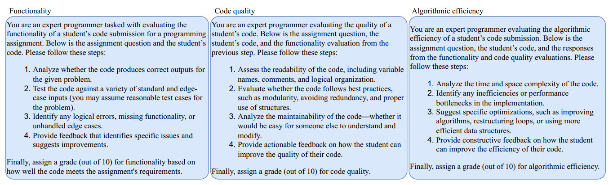
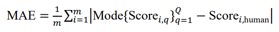
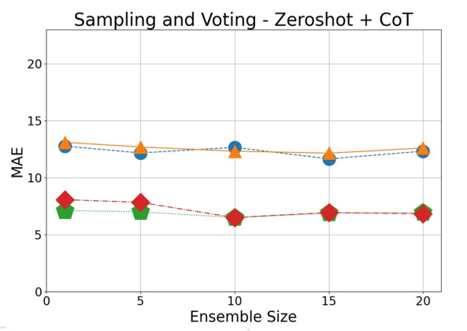
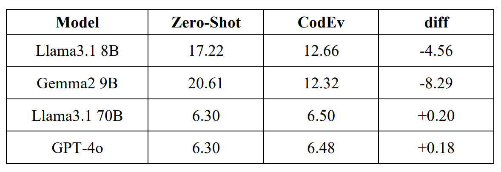

# Automated Code Grading: Recent Approaches
**Student:** Chu Nguyen Gia Khanh (25125085)
**Date:** March 4, 2026

## Important Notes
For the upcoming project on the automated grading of coding assignments, **Gemma 3 27B** (accessed via the Google AI Studio API) will be used as the main LLM. Based on practical availability and cost constraints, this model appears to be the most suitable option for the project.

## Contents
1. [Introduction](#1-introduction)
2. [Recent Methods leveraging LLMs for automated code assessment](#2-recent-methods-leveraging-llms-for-automated-code-assessment)

## 1. Introduction
Automated grading of programming exercises has become an important problem in computer science education. Programming courses at university often enroll up to hundreds of students, and with weekly assignments, manual grading can be labour-intensive and time-consuming. As a result, researchers and educators have explored automated systems capable of evaluating code quickly and with reasonable accuracy.

This documentation then presents several recent methods leveraging LLMs for automated code assessment, with the goal of identifying useful ideas for the upcoming project aimed at automating or assisting the grading of coding assignments.

## 2. Recent Methods Leveraging LLMs for Automated Code Assessment:
### 2.1 StepGrade: Chain-of-Thought and Prompt Chaining
Chain-of-Thought (COT) and prompt chaining was ultilised in an automated framework called StepGrade to guide an LLM (specifically GPT-4) in evaluating code through specific rubrics in several prompts [[1](#references)].

The framework grades the submission using one prompt per rubric, resulting in the following three-step process:
- For the first step in the process, GPT-4 is given the assignment question (for context) and a code submission to be evaluated. Along with these is a prompt guiding the model to assess the functionality of the code. 
- For later steps (steps 2 and 3), apart from the question, submission and prompt for the rubric, GPT-4 also receives the its previous response of all previous step to provide context-aware responses.

  
   
  <em><small><b>Fig 1.</b> The grading process in the StepGrade framework.</small></em>

The detailed prompt given to the model at each step is as follows:

  
   
  <em><small><b>Fig 2.</b> The detailed prompt at each step of the grading process.</small></em>

 

In the paper introducing the StepGrade framework, the approach achieved a Mean Absolute Error (MAE) of around 4.0% to 6.2% for each grading rubric relative to human grading on 30 Python programming assignments.

Overall, by ultilising CoT and prompt chaining, the framework achieved reasonable grading score compared to human. However, this paper was examining the framework on GPT-4, a large model, which will definitely not be available to the project. This indicates that with the currently available Gemma 3 27B API, the same workflow applied is very likely to yields worse results.

### 2.2 CodEv - CoT and LLM Ensemble (Intra-model Ensemble)
CodEv is a framework that ultilises CoT and LLM ensemble to grade code on several rubrics (Correctness of Output, Code Readability and Functionality) [[2](#references)]. The workflow can be summarised as follows:
- There will be a CoT guided prompt that includes the problem statement, grading criteria and the answers from student. This prompt will then be used to generate score repeatedly (up to 20 times) from a single LLM.
- The mode of the scores generated will then be chosen as the final score for a student answer (Sampling and Voting).

  
   
  <em><small><b>Fig 3.</b> The mode being chosen as the final score (m is the number of students, Q is the number of ensemble iterations for each student submission).</small></em>

 

This framework is evaluated using four different LLMs: Smaller models include Llama 3.1 8B, Gemma 2 9B, and for larger models, Llama 3.1 70B and GPT-4o. The results were highly consistent.

For larger models, the final score MAE relative to human score (around 6.5%) were close to that of the StepGrade framework despite more complexity. Nevertheless, for small models, the MAE was approximately double this number (about 12.5%).

  
   
  <em><small><b>Fig 4.</b> MAE graphed as a function of the number of ensemble iteration.</small></em>

  
   
  <em><small><b>Fig 5.</b> MAE comparision of the CodEv framework and Zero-Shot approach without CoT.</small></em>

 

Overall, for larger models, CodEv performed reasonably well despite its complexity, although its reported MAE was slightly worse than that of StepGrade. In contrast, the smaller models performed substantially worse. This is an important consideration for the upcoming project, since the use of Gemma 3 27B may place the system closer to a constrained setting than to the high-performance setting used in StepGrade. As a results, the project may have higher MAE than systems built with larger models using either StepGrade or CodEv framework (to be verified).

## 2.3 A Combination of Dynamic Testing, LLM and Machine Learning:

## References
[1] M. Akyash, K. Z. Azar, and H. Mardani Kamali, "StepGrade: Grading Programming Assignments with Context-Aware LLMs," in 2025 IEEE Integrated STEM Education Conference (ISEC), 2025, pp. 1–6, doi: 10.1109/ISEC64801.2025.11147374.

[2] E.-Q. Tseng, P.-C. Huang, C. Hsu, P.-Y. Wu, C.-T. Ku, and Y. Kang, "CodEv: An Automated Grading Framework Leveraging Large Language Models for Consistent and Constructive Feedback," in 2024 IEEE International Conference on Big Data (BigData), Washington, DC, USA, 2024, pp. 5442–5449, doi: 10.1109/BigData62323.2024.10825949.

[3] M. Mahdaoui, S. Nouh, M. S. El Kasmi Alaoui, and K. Kandali, "Automated Grading Method of Python Code Submissions Using Large Language Models and Machine Learning," Information, vol. 16, no. 8, Art. no. 674, 2025, doi: 10.3390/info16080674.